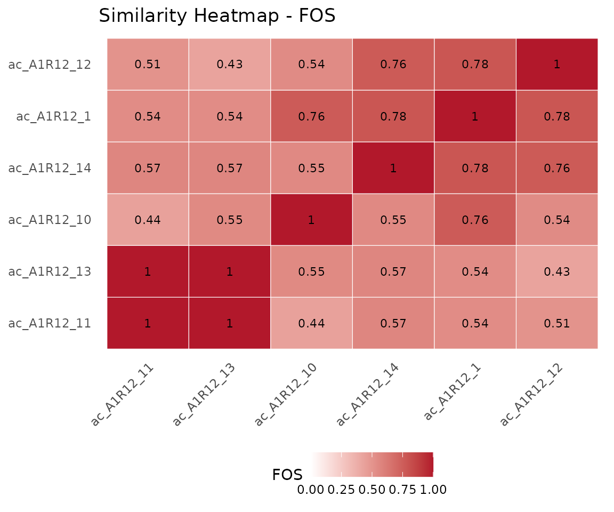

# Alignment of Microbial Consortia

## Introduction

The alignment system in `ramen` quantifies how similar two or more
microbial communities are from a functional perspective – not by which
species are present, but by which metabolite-to-metabolite pathways they
catalyse.
[`align()`](https://admarhi.github.io/ramen/reference/align.md) supports
three modes: **pairwise** (two consortia), **multiple** (all consortia
in a set), and **search** (one query consortium against every member of
a set). All three return a `ConsortiumMetabolismAlignment` (CMA) object
containing similarity scores and (depending on the mode) pathway
correspondences, a consensus network, or a ranked hit table.

This vignette covers the alignment system in depth. For a general
introduction to the package, see
[`vignette("ramen", package = "ramen")`](https://admarhi.github.io/ramen/articles/ramen.md).

**Note on help lookup.** If `tibble` or `pillar` is loaded in your
session, [`?align`](https://admarhi.github.io/ramen/reference/align.md)
may resolve to
[`pillar::align()`](https://pillar.r-lib.org/reference/align.html)
first. To view the documentation for this package’s generic, use
[`?ramen::align`](https://admarhi.github.io/ramen/reference/align.md).

``` r

library(ramen)
```

## Test data

We build six consortia from the bundled `misosoup24` dataset to use
throughout this vignette.

``` r

data("misosoup24")
cm_list <- lapply(seq_len(6), function(i) {
    ConsortiumMetabolism(
        misosoup24[[i]],
        name = names(misosoup24)[i]
    )
})

cms <- ConsortiumMetabolismSet(cm_list, name = "Demo")
```

## Pairwise alignment

### Basic usage

`align(CM, CM)` compares two `ConsortiumMetabolism` objects and returns
a CMA with `Type = "pairwise"`.

``` r

cma <- align(cm_list[[1]], cm_list[[2]])
cma
#> 
#> ── ConsortiumMetabolismAlignment
#> Name: "ac_A1R12_1 vs ac_A1R12_10"
#> Type: "pairwise"
#> Metric: "FOS"
#> Score: 0.7634
#> Query: "ac_A1R12_1", Reference: "ac_A1R12_10"
#> Coverage: query 0.763, reference 0.38
```

### Similarity metrics

Five metrics are available via the `method` argument. Regardless of
which is selected as the primary score, all applicable metrics are
always computed and stored.

``` r

cma_fos <- align(cm_list[[1]], cm_list[[2]], method = "FOS")
cma_jac <- align(cm_list[[1]], cm_list[[2]], method = "jaccard")
scores(cma_fos)
#> $FOS
#> [1] 0.7634409
#> 
#> $jaccard
#> [1] 0.3397129
#> 
#> $brayCurtis
#> [1] 0.3115158
#> 
#> $redundancyOverlap
#> [1] 0.3397129
#> 
#> $coverageQuery
#> [1] 0.7634409
#> 
#> $coverageReference
#> [1] 0.3796791
```

| Metric             | Description                            |
|--------------------|----------------------------------------|
| FOS                | Szymkiewicz-Simpson on binary matrices |
| Jaccard            | Symmetric set similarity               |
| Bray-Curtis        | Flux-weighted similarity               |
| Redundancy Overlap | Weighted Jaccard on nSpecies           |
| MAAS               | 0.4 FOS + 0.2 each of the rest         |

The **Metabolic Alignment Aggregate Score** (MAAS) combines all four
metrics. Weights are renormalized when some metrics are unavailable
(e.g., unweighted networks lack Bray-Curtis):

``` r

cma_maas <- align(cm_list[[1]], cm_list[[2]], method = "MAAS")
scores(cma_maas)
#> $FOS
#> [1] 0.7634409
#> 
#> $jaccard
#> [1] 0.3397129
#> 
#> $brayCurtis
#> [1] 0.3115158
#> 
#> $redundancyOverlap
#> [1] 0.3397129
#> 
#> $coverageQuery
#> [1] 0.7634409
#> 
#> $coverageReference
#> [1] 0.3796791
#> 
#> $MAAS
#> [1] 0.5035647
```

### The FOS subset property

FOS uses the Szymkiewicz-Simpson coefficient, which divides by the
**smaller** network. This means FOS = 1 whenever a small consortium is a
strict functional subset of a larger one – even if the larger consortium
has many additional pathways.

To detect this, `ramen` reports **coverage ratios** alongside the
similarity metrics:

``` r

scores(cma_fos)[c("FOS", "coverageQuery", "coverageReference")]
#> $FOS
#> [1] 0.7634409
#> 
#> $coverageQuery
#> [1] 0.7634409
#> 
#> $coverageReference
#> [1] 0.3796791
```

- `coverageQuery`: fraction of the query’s pathways found in the
  reference
- `coverageReference`: fraction of the reference’s pathways found in the
  query

When FOS is high but one coverage ratio is low, the alignment represents
a subset relationship rather than true functional equivalence. For
symmetric similarity, use Jaccard instead.

### Pathway correspondences

The alignment classifies every metabolite-to-metabolite pathway as
shared, unique to the query, or unique to the reference.

``` r

## All pathways in the alignment
head(pathways(cma))
#> # A tibble: 6 × 2
#>   consumed produced
#>   <chr>    <chr>   
#> 1 acald    ac      
#> 2 asp__L   ac      
#> 3 gly      ac      
#> 4 gthrd    ac      
#> 5 h2o2     ac      
#> 6 h2s      ac

## Shared pathways only
shared <- pathways(cma, type = "shared")
nrow(shared)
#> [1] 71

## Unique pathways (returns a list with $query and $reference)
unique_pw <- pathways(cma, type = "unique")
nrow(unique_pw$query)
#> [1] 22
nrow(unique_pw$reference)
#> [1] 116
```

### Permutation p-values

Statistical significance is assessed by degree-preserving network
rewiring. The query network’s pathways are shuffled while preserving
each metabolite’s degree, and the metric is recomputed under the null
distribution. For MAAS, only the binary network topology is permuted;
the weighted assays (Consumption, Production, nSpecies) remain fixed, so
the null distribution reflects topological variation in the composite
score.

``` r

cma_p <- align(
    cm_list[[1]],
    cm_list[[2]],
    method = "FOS",
    computePvalue = TRUE,
    nPermutations = 99L
)
scores(cma_p)
#> $FOS
#> [1] 0.7634409
#> 
#> $jaccard
#> [1] 0.3397129
#> 
#> $brayCurtis
#> [1] 0.3115158
#> 
#> $redundancyOverlap
#> [1] 0.3397129
#> 
#> $coverageQuery
#> [1] 0.7634409
#> 
#> $coverageReference
#> [1] 0.3796791
#> 
#> $pvalue
#> [1] 0.01
```

### Visualization

#### Network plot

The network view shows shared (green), query-unique (blue), and
reference-unique (red) pathways as a directed metabolite flow graph.

``` r

plot(cma, type = "network")
```


Pairwise alignment network.

#### Score bar chart

``` r

plot(cma, type = "scores")
```


Pairwise metric scores.

## Multiple alignment

### Aligning a consortium set

`align(CMS)` computes pairwise similarities across all consortia in a
`ConsortiumMetabolismSet` and returns a CMA with `Type = "multiple"`.

``` r

cma_mult <- align(cms)
cma_mult
```

### Similarity matrix

The similarity matrix is an n x n symmetric matrix with 1s on the
diagonal. For FOS, this is derived from the pre-computed CMS overlap
matrix:

``` r

round(similarityMatrix(cma_mult), 3)
#>             ac_A1R12_1 ac_A1R12_10 ac_A1R12_11 ac_A1R12_12 ac_A1R12_13
#> ac_A1R12_1       1.000       0.763       0.538       0.785       0.538
#> ac_A1R12_10      0.763       1.000       0.438       0.542       0.549
#> ac_A1R12_11      0.538       0.438       1.000       0.507       1.000
#> ac_A1R12_12      0.785       0.542       0.507       1.000       0.430
#> ac_A1R12_13      0.538       0.549       1.000       0.430       1.000
#> ac_A1R12_14      0.785       0.551       0.567       0.764       0.567
#>             ac_A1R12_14
#> ac_A1R12_1        0.785
#> ac_A1R12_10       0.551
#> ac_A1R12_11       0.567
#> ac_A1R12_12       0.764
#> ac_A1R12_13       0.567
#> ac_A1R12_14       1.000
```

### Summary scores

For a multiple alignment, the primary score is the **median** of all
pairwise scores.
[`scores()`](https://admarhi.github.io/ramen/reference/scores.md)
returns full summary statistics:

``` r

scores(cma_mult)
#> $mean
#> [1] 0.6215862
#> 
#> $median
#> [1] 0.5511811
#> 
#> $min
#> [1] 0.4295775
#> 
#> $max
#> [1] 1
#> 
#> $sd
#> [1] 0.1597042
#> 
#> $nPairs
#> [1] 15
```

### Consensus network and prevalence

Pathway prevalence counts how many consortia share each
metabolite-to-metabolite pathway. This enables classification of
pathways as core (present in most consortia) or niche (present in few).

``` r

prev <- prevalence(cma_mult)
head(prev[order(-prev$nConsortia), ])
#>    consumed produced nConsortia proportion
#> 21   asp__L       ac          6          1
#> 24      gly       ac          6          1
#> 30      pyr       ac          6          1
#> 56   asp__L   ala__D          6          1
#> 59      gly   ala__D          6          1
#> 65      pyr   ala__D          6          1

## Distribution of prevalence
table(prev$nConsortia)
#> 
#>   1   2   3   4   5   6 
#> 100  75  55  51  14  30
```

The
[`pathways()`](https://admarhi.github.io/ramen/reference/pathways.md)
method with `type = "consensus"` returns the same information:

``` r

head(pathways(cma_mult, type = "consensus"))
#>   consumed produced nConsortia proportion
#> 1    acald    4abut          1  0.1666667
#> 2   arg__L    4abut          1  0.1666667
#> 3   asp__L    4abut          1  0.1666667
#> 4     etoh    4abut          1  0.1666667
#> 5      gly    4abut          1  0.1666667
#> 6   leu__L    4abut          1  0.1666667
```

### Visualization

#### Heatmap

The heatmap shows pairwise similarities with dendrogram-based ordering:

``` r

plot(cma_mult, type = "heatmap")
```



Similarity heatmap.

#### Score summary

``` r

plot(cma_mult, type = "scores")
```


Multiple alignment summary scores.

## Database search

`align(CM, CMS)` compares a single query consortium against every member
of a set and returns a CMA with `Type = "search"`. This is the natural
call for questions like “which consortium in my database is most
functionally similar to this query?”

### Basic search

We hold out the first consortium as a query and search it against a
database built from the remaining five:

``` r

query <- cm_list[[1]]
db <- ConsortiumMetabolismSet(cm_list[-1], name = "db")
```

``` r

hits <- align(query, db)
#> Searching 5 consortia using "FOS".
hits
#> 
#> ── ConsortiumMetabolismAlignment 
#> Name: "ac_A1R12_1 vs CMS (5 consortia)"
#> Type: "search"
#> Metric: "FOS"
#> Score: 0.7849
#> Query: "ac_A1R12_1", Top hit: "ac_A1R12_12" (of 5 consortia)
```

The top-hit name and score sit on `ReferenceName` / `PrimaryScore`. The
full ranked table is stored in `Scores$ranking`:

``` r

ranking <- scores(hits)$ranking
head(ranking)
#> # A tibble: 5 × 8
#>   reference   score   FOS jaccard brayCurtis redundancyOverlap coverageQuery
#>   <chr>       <dbl> <dbl>   <dbl>      <dbl>             <dbl>         <dbl>
#> 1 ac_A1R12_12 0.785 0.785   0.451      0.635             0.451         0.785
#> 2 ac_A1R12_14 0.785 0.785   0.497      0.553             0.497         0.785
#> 3 ac_A1R12_10 0.763 0.763   0.340      0.312             0.340         0.763
#> 4 ac_A1R12_11 0.538 0.538   0.226      0.500             0.226         0.538
#> 5 ac_A1R12_13 0.538 0.538   0.270      0.515             0.270         0.538
#> # ℹ 1 more variable: coverageReference <dbl>
```

Each row holds the reference consortium’s name, the primary `score`
(under the requested `method`), all four individual metric columns, and
the coverage ratios against the query. Rows are pre-sorted by `score` in
descending order.

### Top-K hits

Use `topK` to truncate the ranked table – useful when the database is
large and only the best matches matter:

``` r

hits_top3 <- align(query, db, topK = 3L)
#> Searching 5 consortia using "FOS".
scores(hits_top3)$ranking
#> # A tibble: 3 × 8
#>   reference   score   FOS jaccard brayCurtis redundancyOverlap coverageQuery
#>   <chr>       <dbl> <dbl>   <dbl>      <dbl>             <dbl>         <dbl>
#> 1 ac_A1R12_12 0.785 0.785   0.451      0.635             0.451         0.785
#> 2 ac_A1R12_14 0.785 0.785   0.497      0.553             0.497         0.785
#> 3 ac_A1R12_10 0.763 0.763   0.340      0.312             0.340         0.763
#> # ℹ 1 more variable: coverageReference <dbl>
```

[`similarityMatrix()`](https://admarhi.github.io/ramen/reference/similarityMatrix.md)
returns a 1 x n row vector (or 1 x topK if truncated), with the query
name as the row label:

``` r

round(similarityMatrix(hits_top3), 3)
#>            ac_A1R12_12 ac_A1R12_14 ac_A1R12_10
#> ac_A1R12_1       0.785       0.785       0.763
```

Pathway correspondences always reflect the single overall top hit,
regardless of `topK`:

``` r

head(pathways(hits_top3, type = "shared"))
#> # A tibble: 6 × 2
#>   consumed produced
#>   <chr>    <chr>   
#> 1 asp__L   ac      
#> 2 etoh     ac      
#> 3 gly      ac      
#> 4 gthrd    ac      
#> 5 h2o2     ac      
#> 6 pyr      ac
```

### Choosing metrics

By default all four base metrics are computed for every database member.
For large databases, restricting `metrics` skips the weighted-assay
expansion and can be substantially faster:

``` r

hits_fos <- align(query, db, metrics = "FOS")
#> Searching 5 consortia using "FOS".
scores(hits_fos)$ranking[,
    c("reference", "score", "brayCurtis")
]
#> # A tibble: 5 × 3
#>   reference   score brayCurtis
#>   <chr>       <dbl>      <dbl>
#> 1 ac_A1R12_12 0.785         NA
#> 2 ac_A1R12_14 0.785         NA
#> 3 ac_A1R12_10 0.763         NA
#> 4 ac_A1R12_11 0.538         NA
#> 5 ac_A1R12_13 0.538         NA
```

Columns for skipped metrics remain in the ranking table but are filled
with `NA`, making the schema stable across calls.

### Significance of the top hit

As in pairwise alignment, `computePvalue = TRUE` runs a
degree-preserving permutation test. For database search, the test is
applied only to the top hit – a BLAST-style convention that keeps the
cost comparable to a single pairwise p-value:

``` r

hits_p <- align(
    query,
    db,
    computePvalue = TRUE,
    nPermutations = 99L
)
#> Searching 5 consortia using "FOS".
hits_p
#> 
#> ── ConsortiumMetabolismAlignment 
#> Name: "ac_A1R12_1 vs CMS (5 consortia)"
#> Type: "search"
#> Metric: "FOS"
#> Score: 0.7849
#> P-value: "0.01"
#> Query: "ac_A1R12_1", Top hit: "ac_A1R12_12" (of 5 consortia)
```

The `show()` output reports the top hit, its score, and the p-value
directly; `scores(hits_p)` gives the full numeric breakdown including
`pvalue`.

If statistical confidence is needed for several top hits, re-run
[`align()`](https://admarhi.github.io/ramen/reference/align.md) in
pairwise mode against each candidate individually.

## Accessor reference

| Accessor | Alignment type | Returns |
|----|----|----|
| [`scores()`](https://admarhi.github.io/ramen/reference/scores.md) | all | Named list of scores (+ `$ranking` for search) |
| [`pathways()`](https://admarhi.github.io/ramen/reference/pathways.md) | all | data.frame of all pathways |
| `pathways(type = "shared")` | pairwise, search | shared pathways |
| `pathways(type = "unique")` | pairwise, search | list(query, reference) |
| `pathways(type = "consensus")` | multiple | data.frame with prevalence |
| [`similarityMatrix()`](https://admarhi.github.io/ramen/reference/similarityMatrix.md) | multiple, search | n x n or 1 x n numeric matrix |
| [`prevalence()`](https://admarhi.github.io/ramen/reference/prevalence.md) | multiple | data.frame with nConsortia |
| [`metabolites()`](https://admarhi.github.io/ramen/reference/metabolites.md) | all | Character vector of metabolites |

Type guards prevent misuse – for example, calling
`pathways(type = "consensus")` on a pairwise alignment raises an
informative error.

## Session info

``` r

sessionInfo()
#> R version 4.6.0 (2026-04-24)
#> Platform: x86_64-pc-linux-gnu
#> Running under: Ubuntu 24.04.4 LTS
#> 
#> Matrix products: default
#> BLAS:   /usr/lib/x86_64-linux-gnu/openblas-pthread/libblas.so.3 
#> LAPACK: /usr/lib/x86_64-linux-gnu/openblas-pthread/libopenblasp-r0.3.26.so;  LAPACK version 3.12.0
#> 
#> locale:
#>  [1] LC_CTYPE=C.UTF-8       LC_NUMERIC=C           LC_TIME=C.UTF-8       
#>  [4] LC_COLLATE=C.UTF-8     LC_MONETARY=C.UTF-8    LC_MESSAGES=C.UTF-8   
#>  [7] LC_PAPER=C.UTF-8       LC_NAME=C              LC_ADDRESS=C          
#> [10] LC_TELEPHONE=C         LC_MEASUREMENT=C.UTF-8 LC_IDENTIFICATION=C   
#> 
#> time zone: UTC
#> tzcode source: system (glibc)
#> 
#> attached base packages:
#> [1] stats     graphics  grDevices utils     datasets  methods   base     
#> 
#> other attached packages:
#> [1] ramen_0.99.0     BiocStyle_2.40.0
#> 
#> loaded via a namespace (and not attached):
#>  [1] SummarizedExperiment_1.42.0     gtable_0.3.6                   
#>  [3] ggplot2_4.0.3                   xfun_0.57                      
#>  [5] bslib_0.10.0                    Biobase_2.72.0                 
#>  [7] lattice_0.22-9                  yulab.utils_0.2.4              
#>  [9] vctrs_0.7.3                     tools_4.6.0                    
#> [11] generics_0.1.4                  stats4_4.6.0                   
#> [13] parallel_4.6.0                  tibble_3.3.1                   
#> [15] pkgconfig_2.0.3                 Matrix_1.7-5                   
#> [17] RColorBrewer_1.1-3              S7_0.2.2                       
#> [19] desc_1.4.3                      S4Vectors_0.50.0               
#> [21] lifecycle_1.0.5                 farver_2.1.2                   
#> [23] compiler_4.6.0                  treeio_1.36.1                  
#> [25] textshaping_1.0.5               Biostrings_2.80.0              
#> [27] Seqinfo_1.2.0                   codetools_0.2-20               
#> [29] htmltools_0.5.9                 sass_0.4.10                    
#> [31] yaml_2.3.12                     lazyeval_0.2.3                 
#> [33] pkgdown_2.2.0                   pillar_1.11.1                  
#> [35] crayon_1.5.3                    jquerylib_0.1.4                
#> [37] tidyr_1.3.2                     BiocParallel_1.46.0            
#> [39] SingleCellExperiment_1.34.0     DelayedArray_0.38.1            
#> [41] cachem_1.1.0                    viridis_0.6.5                  
#> [43] abind_1.4-8                     nlme_3.1-169                   
#> [45] tidyselect_1.2.1                digest_0.6.39                  
#> [47] dplyr_1.2.1                     purrr_1.2.2                    
#> [49] bookdown_0.46                   labeling_0.4.3                 
#> [51] TreeSummarizedExperiment_2.20.0 fastmap_1.2.0                  
#> [53] grid_4.6.0                      cli_3.6.6                      
#> [55] SparseArray_1.12.2              magrittr_2.0.5                 
#> [57] S4Arrays_1.12.0                 utf8_1.2.6                     
#> [59] ape_5.8-1                       withr_3.0.2                    
#> [61] scales_1.4.0                    rappdirs_0.3.4                 
#> [63] rmarkdown_2.31                  XVector_0.52.0                 
#> [65] matrixStats_1.5.0               igraph_2.3.1                   
#> [67] gridExtra_2.3                   ragg_1.5.2                     
#> [69] evaluate_1.0.5                  knitr_1.51                     
#> [71] GenomicRanges_1.64.0            IRanges_2.46.0                 
#> [73] viridisLite_0.4.3               rlang_1.2.0                    
#> [75] dendextend_1.19.1               Rcpp_1.1.1-1.1                 
#> [77] glue_1.8.1                      tidytree_0.4.7                 
#> [79] BiocManager_1.30.27             BiocGenerics_0.58.0            
#> [81] jsonlite_2.0.0                  R6_2.6.1                       
#> [83] MatrixGenerics_1.24.0           systemfonts_1.3.2              
#> [85] fs_2.1.0
```
