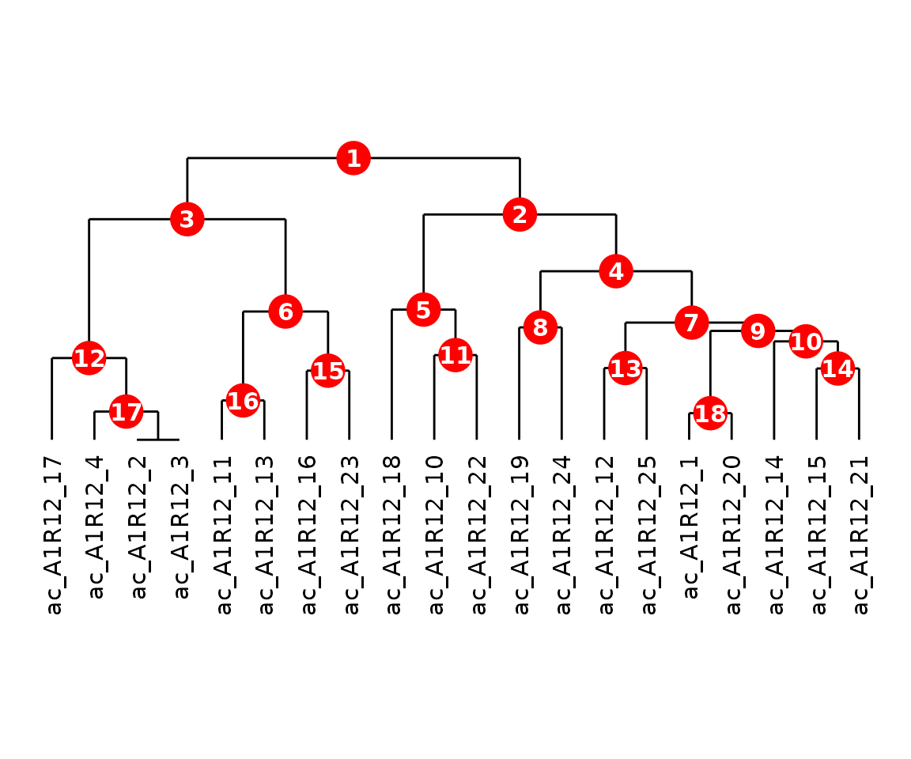
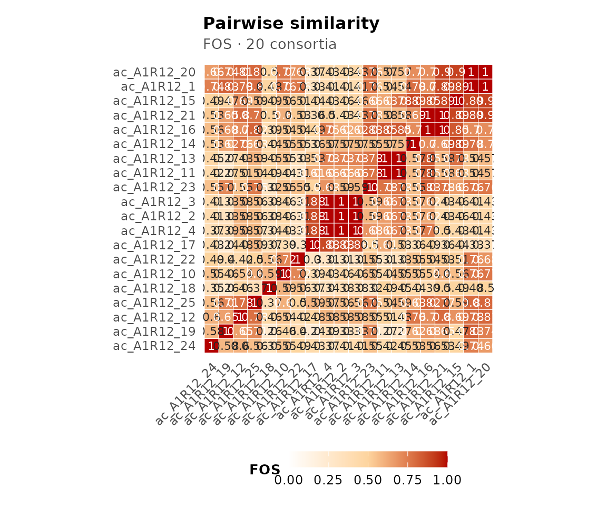

# Introduction to ramen

## Installation

`ramen` can be installed from Bioconductor:

``` r

if (!requireNamespace("BiocManager", quietly = TRUE))
    install.packages("BiocManager")

BiocManager::install("ramen")
```

``` r

library(ramen)
```

## Overview

`ramen` (**R**econstruction and **A**lignment of **M**icrobial
**E**xchange **N**etworks) analyses the functional similarity of
microbial communities from a metabolic network perspective. Rather than
comparing communities by species composition, `ramen` asks: *which
metabolite-to-metabolite pathways does each community catalyse, and how
similar are the resulting networks?*

### Key concept: pathways

Throughout `ramen`, a **pathway** is a directed edge from one metabolite
to another: “metabolite A is consumed and metabolite B is produced by at
least one species.” This is *not* a biochemical pathway in the KEGG or
MetaCyc sense (e.g. glycolysis). Rather, it captures a single metabolic
exchange coupling within the community. A consortium’s full set of
pathways forms a square metabolite-by-metabolite network that encodes
its collective metabolic capability.

### Package classes

The package provides three S4 classes that build on Bioconductor’s
*[TreeSummarizedExperiment](https://bioconductor.org/packages/3.23/TreeSummarizedExperiment)*:

- **`ConsortiumMetabolism`** (CM) – a single community’s metabolic
  exchange network
- **`ConsortiumMetabolismSet`** (CMS) – a collection of CMs with
  precomputed overlap scores and a dendrogram
- **`ConsortiumMetabolismAlignment`** (CMA) – the result of aligning two
  or more communities

This vignette walks through a complete analysis from data import to
alignment using the bundled `misosoup24` dataset (56 metabolic solutions
from [MiSoSoup](https://github.com/sirno/misosoup)). For details on
alignment metrics, see
[`vignette("alignment", package = "ramen")`](https://admarhi.github.io/ramen/articles/alignment.md);
for a gallery of all plot types, see
[`vignette("visualisation", package = "ramen")`](https://admarhi.github.io/ramen/articles/visualisation.md).

### Why “consortium” and not “community”?

`ramen` deliberately uses the term *consortium* throughout. A consortium
here is defined by its **metabolic function** – the set of
metabolite-to-metabolite pathways its member species collectively
catalyse – not by its taxonomic composition. Two assemblages with
entirely different species rosters but identical exchange networks are,
from `ramen`’s perspective, the same consortium; conversely, two
assemblages with the same species but different active pathways are
different consortia. This functional framing follows a long-standing
argument in microbial ecology that ecosystem behaviour is more robustly
predicted by what microbes *do* than by which microbes are present
(Falkowski, Fenchel & Delong 2008, *Science* **320**:1034).

## Key Concepts

A short glossary of terms used throughout the package:

- **Consortium** – a microbial assemblage characterised by its metabolic
  exchange network, not its species composition (see above).
- **Pathway** – in the `ramen` sense, a directed
  metabolite-to-metabolite edge: metabolite *A* is consumed and
  metabolite *B* is produced by at least one species. Not a KEGG/MetaCyc
  biochemical pathway.
- **Assay** – one of the six *m x m* metabolite-by-metabolite matrices
  stored in a `ConsortiumMetabolism` object (Binary, nSpecies,
  Consumption, Production, EffectiveConsumption, EffectiveProduction).
- **FOS** – Functional Overlap Score; the primary similarity metric
  between two consortia, computed as the Szymkiewicz-Simpson coefficient
  on expanded binary pathway matrices.
- **Szymkiewicz-Simpson** – an asymmetric set-overlap coefficient
  `|X intersect Y| / min(|X|, |Y|)` that measures how completely the
  smaller set is contained in the larger.
- **Alignment** – the operation of putting two or more consortia in
  correspondence in a shared metabolite/pathway space and summarising
  their similarity, returning a `ConsortiumMetabolismAlignment`.
- **MAAS** – Metabolite Abundance Adjusted Score; a
  flux-magnitude-weighted variant of FOS that down-weights pathways with
  very small fluxes.

## Data import

### The `misosoup24` dataset

`ramen` ships with `misosoup24`, a list of 56 metabolic solutions. Each
element is a data.frame with columns `metabolites`, `species`, and
`fluxes`, where negative fluxes indicate consumption and positive fluxes
indicate production.

> **Metabolite identifiers** follow the [BiGG
> namespace](https://bigg.ucsd.edu) (King et al. 2016): short lowercase
> codes such as `ac` (acetate), `co2` (CO₂), `etoh` (ethanol), and `pyr`
> (pyruvate). Double-underscores encode stereochemistry: `ala__L` =
> L-alanine, `ala__D` = D-alanine. Look up any identifier at
> <https://bigg.ucsd.edu/metabolites>.

### Metabolite identifier hygiene

`ramen` performs **string-equality matching** on metabolite identifiers.
Two species that consume the same molecule under different naming
conventions will appear to consume two distinct metabolites in the
network: a CM whose edge list mixes `ac_e` (BiGG), `CHEBI:30089`
(ChEBI), and `acetate` (free text) for the same compound will yield
three separate metabolite nodes rather than one. The same applies across
CMs in a `ConsortiumMetabolismSet` or across operands of an
[`align()`](https://admarhi.github.io/ramen/reference/align.md) call:
identifiers must match character-for-character to be treated as the same
metabolite.

Pick one namespace and stick with it across all CMs in a CMS or
alignment. The package does **not** currently provide a
name-normalisation helper; cross-namespace mapping (BiGG to ChEBI, ChEBI
to free text, etc.) is the user’s responsibility, ideally performed once
at the data-import step before constructing CMs.

### Species identifier hygiene

The same string-equality contract applies to **species names**. A
consortium that labels a strain `E_coli` and another that labels the
same strain `E.coli`, `Ecoli`, or `Escherichia_coli` will be treated as
harbouring three or four distinct species once the CMs are assembled
into a `ConsortiumMetabolismSet`, compared via
[`compareSpecies()`](https://admarhi.github.io/ramen/reference/compareSpecies.md),
or aligned with
[`align()`](https://admarhi.github.io/ramen/reference/align.md). The
mismatch is silent: there is no warning, just an inflated species count
and spurious zeros in the cross-consortium overlap.

Common typo patterns that quietly fragment a single organism into
several are case differences (`E_coli` vs `e_coli` vs `E_Coli`),
separator differences (`E_coli` vs `E.coli` vs `E-coli` vs `E coli`),
abbreviation versus full name (`Ecoli` vs `E.coli` vs `Escherichia_coli`
vs `Escherichia coli`), and inconsistent strain suffixes (`E.coli_K12`
vs `E.coli_k12` vs bare `E.coli`). A minimal first pass collapses case
and separators, which catches the first two classes:

``` r

data$species <- gsub("[._\\s-]+", "_", tolower(data$species))
```

Abbreviation-to-full-name reconciliation and strain-suffix
disambiguation are genuinely harder and typically require a
project-specific lookup table; pick a canonical scheme, normalise once
at the data-import step, and apply it before constructing any CM.
`ramen` does not currently ship a `cleanSpecies()` helper, so this
hygiene step is the user’s responsibility – the same caveat applies
symmetrically to every downstream comparison, including
[`compareSpecies()`](https://admarhi.github.io/ramen/reference/compareSpecies.md)
and cross-consortium
[`align()`](https://admarhi.github.io/ramen/reference/align.md).

``` r

data("misosoup24")
length(misosoup24)
#> [1] 56
names(misosoup24)[1:8]
#> [1] "ac_A1R12_1"  "ac_A1R12_10" "ac_A1R12_11" "ac_A1R12_12" "ac_A1R12_13"
#> [6] "ac_A1R12_14" "ac_A1R12_15" "ac_A1R12_16"
head(misosoup24[[1]])
#> # A tibble: 6 × 3
#>   metabolite species    flux
#>   <chr>      <chr>     <dbl>
#> 1 ac         A1R12     0.773
#> 2 ac         I2R16   -10.8  
#> 3 acald      A1R12    -1.12 
#> 4 acald      I2R16     1.12 
#> 5 ala__D     A1R12     0.760
#> 6 ala__D     I2R16    -0.760
```

> **Caution – alternative optima.** MiSoSoup is a Mixed Integer Linear
> Programming (MILP) enumerator: for a single underlying metabolic model
> it returns *multiple alternative optimal solutions* to the same growth
> problem. Two such alternatives will typically share most of their
> pathways and produce very high pairwise FOS values. This high overlap
> is **expected by construction** and reflects solver consistency, not
> biological similarity. When interpreting overlap scores, compare
> consortia derived from *different* models or conditions; treat overlap
> between alternatives of the same model as a sanity check on the
> enumeration, not as an ecological signal.

### Importing raw MiSoSoup YAML

For raw MiSoSoup output (nested YAML),
[`importMisosoup()`](https://admarhi.github.io/ramen/reference/importMisosoup.md)
parses the data directly into a `ConsortiumMetabolismSet` containing one
`ConsortiumMetabolism` per viable solution. The function accepts a
single YAML file, a directory of YAML files, or a pre-loaded nested list
from
[`yaml::read_yaml()`](https://yaml.r-lib.org/reference/read_yaml.html).
Media-level exchange bounds are stashed in each CM’s `metadata()` slot
under `$media` so they remain accessible if needed.

``` r

## Single file -> CMS (not run -- requires external data)
cms <- importMisosoup("path/to/misosoup_output.yaml")

## Directory of YAML files -> CMS merging all consortia
cms <- importMisosoup("path/to/misosoup_dir/", name = "experiment1")

## Pre-loaded list -> CMS (name required)
raw <- yaml::read_yaml("path/to/misosoup_output.yaml")
cms <- importMisosoup(raw, name = "experiment1")

## Access stashed media bounds for a specific CM
## S4Vectors::metadata(cms@Consortia[[1]])$media
```

### Alternative input formats

The
[`ConsortiumMetabolism()`](https://admarhi.github.io/ramen/reference/ConsortiumMetabolism.md)
constructor accepts any data.frame with columns `species`, `metabolite`,
and `flux`. Custom column names can be specified via `species_col`,
`metabolite_col`, and `flux_col`.

If your data is in wide format with separate columns for consumed and
produced metabolites,
[`pivotCM()`](https://admarhi.github.io/ramen/reference/pivotCM.md)
converts it to the long format that
[`ConsortiumMetabolism()`](https://admarhi.github.io/ramen/reference/ConsortiumMetabolism.md)
expects:

``` r

wide_data <- data.frame(
    species = c("Sp_A", "Sp_B", "Sp_C"),
    uptake = c("met1", "met2", "met3"),
    secretion = c("met2", "met3", "met1"),
    flux = c(1, 1, 1)
)

long_data <- pivotCM(
    wide_data,
    species = "species",
    from = "uptake",
    to = "secretion",
    flux = "flux"
)
head(long_data)
#> # A tibble: 6 × 3
#>   species met    flux
#>   <chr>   <chr> <dbl>
#> 1 Sp_A    met1     -1
#> 2 Sp_A    met2      1
#> 3 Sp_B    met2     -1
#> 4 Sp_B    met3      1
#> 5 Sp_C    met3     -1
#> 6 Sp_C    met1      1
```

### Importing from MICOM / cobrapy

[`ConsortiumMetabolism()`](https://admarhi.github.io/ramen/reference/ConsortiumMetabolism.md)
accepts any long-format `data.frame` with columns `species`,
`metabolite`, and `flux` (negative = consumption, positive =
production). This makes interoperation with the Python-based
[MICOM](https://github.com/micom-dev/micom) and
[cobrapy](https://github.com/opencobra/cobrapy) ecosystems
straightforward: export per-species exchange fluxes to CSV from Python,
then read into R.

A minimal MICOM growth solution can be exported as follows:

``` python
import pandas as pd
from micom import Community
from micom.workflows import grow

## com is a pre-built micom.Community
sol = com.cooperative_tradeoff()

## sol.exchanges is a tidy DataFrame with columns
##   reaction, metabolite, taxon (species), flux, ...
exchanges = sol.exchanges[["taxon", "metabolite", "flux"]]
exchanges.columns = ["species", "metabolite", "flux"]
exchanges.to_csv("micom_exchanges.csv", index = False)
```

The same pattern works for a plain `cobra.Model`: iterate over
`model.exchanges`, record the carrying species, and write the columns
above.

On the R side:

``` r

exch <- read.csv("micom_exchanges.csv")
cm_micom <- ConsortiumMetabolism(exch, name = "micom_run1")
```

## Building a ConsortiumMetabolism

### From `misosoup24`

``` r

cm1 <- ConsortiumMetabolism(
    misosoup24[[1]],
    name = names(misosoup24)[1]
)
cm1
#> 
#> ── ConsortiumMetabolism
#> Name: "ac_A1R12_1"
#> Weighted metabolic network: 2 species, 14 metabolites, 93 pathways.
#> Pathways per species: min 45, mean 46.5, max 48.
```

### Synthetic data with `synCM()`

For quick testing,
[`synCM()`](https://admarhi.github.io/ramen/reference/synCM.md)
generates a random consortium:

``` r

cm_syn <- synCM("Synthetic", n_species = 4, max_met = 8, seed = 42)
cm_syn
#> 
#> ── ConsortiumMetabolism
#> Name: "Synthetic"
#> Weighted metabolic network: 4 species, 8 metabolites, 13 pathways.
#> Pathways per species: min 1, mean 4, max 12.
```

### Inspecting a CM

A CM inherits from `TreeSummarizedExperiment`, so standard dimension
accessors work. Rows and columns both correspond to metabolites (it is a
square metabolite-by-metabolite matrix):

``` r

dim(cm1)
#> [1] 14 14
```

The six assay matrices encode different views of the network:

``` r

SummarizedExperiment::assayNames(cm1)
#> [1] "Binary"                       "nSpecies"                    
#> [3] "Consumption"                  "Production"                  
#> [5] "EffectiveConsumption"         "EffectiveProduction"         
#> [7] "nEffectiveSpeciesConsumption" "nEffectiveSpeciesProduction"
```

| Assay                | Content                                  |
|----------------------|------------------------------------------|
| Binary               | 1 if a pathway exists, 0 otherwise       |
| nSpecies             | Number of species catalysing the pathway |
| Consumption          | Summed consumption flux                  |
| Production           | Summed production flux                   |
| EffectiveConsumption | Effective number of consuming species    |
| EffectiveProduction  | Effective number of producing species    |

### Accessors

``` r

name(cm1)
#> [1] "ac_A1R12_1"
species(cm1)
#> [1] "A1R12" "I2R16"
metabolites(cm1)
#>  [1] "ac"     "acald"  "ala__D" "ala__L" "asp__L" "co2"    "etoh"   "glu__L"
#>  [9] "gly"    "gthox"  "gthrd"  "h2o2"   "h2s"    "pyr"
```

[`pathways()`](https://admarhi.github.io/ramen/reference/pathways.md)
returns per-pathway summary statistics:

``` r

head(pathways(cm1))
#> # A tibble: 6 × 3
#>   consumed produced n_species
#>   <chr>    <chr>        <dbl>
#> 1 ac       acald            1
#> 2 ac       asp__L           1
#> 3 ac       co2              1
#> 4 ac       etoh             1
#> 5 ac       gly              1
#> 6 ac       gthrd            1
```

[`as.data.frame()`](https://rdrr.io/r/base/as.data.frame.html) returns
the underlying edge list. Use this to export a CM’s data for downstream
tools:

``` r

head(as.data.frame(cm1))
#>      met species        flux
#> 1     ac   A1R12   0.7729250
#> 2     ac   I2R16 -10.7673345
#> 3  acald   A1R12  -1.1209639
#> 4  acald   I2R16   1.1209639
#> 5 ala__D   A1R12   0.7603136
#> 6 ala__D   I2R16  -0.7603136
```

([`consortia()`](https://admarhi.github.io/ramen/reference/consortia.md)
is reserved for containers of CMs – `ConsortiumMetabolismSet` and
`ConsortiumMetabolismAlignment` – since the noun is plural.)

Replacement methods allow renaming:

``` r

name(cm1) <- "first_solution"
name(cm1)
#> [1] "first_solution"
```

## Building a ConsortiumMetabolismSet

A `ConsortiumMetabolismSet` groups multiple CMs. During construction,
`ramen` automatically expands all binary matrices to a shared universal
metabolite space, computes pairwise overlap scores, and builds a
hierarchical clustering dendrogram. By default the constructor prints a
step-by-step progress trace; pass `verbose = FALSE` to silence it.

``` r

## Build 20 CMs from misosoup24
cm_list <- lapply(seq_len(20), function(i) {
    ConsortiumMetabolism(
        misosoup24[[i]],
        name = names(misosoup24)[i]
    )
})

cms <- ConsortiumMetabolismSet(
    cm_list,
    name = "MiSoSoup_20",
    verbose = FALSE
)
cms
```

### Species across the set

[`species()`](https://admarhi.github.io/ramen/reference/species.md)
returns all species with the number of distinct pathways each catalyses:

``` r

species(cms)
#>  [1] "A1R12"  "A3R04"  "A3R12"  "B3M02"  "B3R10"  "C1M14"  "C2M11"  "C2R02" 
#>  [9] "C3R12"  "D2M19"  "D2R05"  "D3R19"  "E3M18"  "E3R01"  "E3R11"  "F3R08" 
#> [17] "G2R10"  "I2R16"  "I3M07"  "m_3C02" "m_3D05" "m_4B03" "m_6C06"
```

Filter by metabolic role – generalists (top fraction by pathway count)
or specialists (bottom fraction):

``` r

species(cms, type = "generalists")
#> [1] "A1R12" "D2M19" "E3M18" "F3R08"
species(cms, type = "specialists")
#> [1] "A3R04" "B3R10" "C1M14" "I2R16"
```

### Pathway classification

[`pathways()`](https://admarhi.github.io/ramen/reference/pathways.md)
with a `type` argument classifies pathways by prevalence:

``` r

## Pan-consortia: present in many consortia (top fraction)
head(pathways(cms, type = "pan-cons"))
#> # A tibble: 6 × 4
#>   consumed produced n_species n_cons
#>   <chr>    <chr>        <int>  <int>
#> 1 ac       pyr             20     20
#> 2 ala__L   pyr             20     20
#> 3 etoh     co2              5     20
#> 4 h2s      co2             15     20
#> 5 pyr      ac               1     20
#> 6 pyr      ala__L           1     20

## Niche: present in few consortia (bottom fraction)
head(pathways(cms, type = "niche"))
#> # A tibble: 6 × 4
#>   consumed     produced n_species n_cons
#>   <chr>        <chr>        <int>  <int>
#> 1 LalaDgluMdap ac               1      1
#> 2 LalaDgluMdap ala__D           1      1
#> 3 LalaDgluMdap ala__L           1      1
#> 4 LalaDgluMdap co2              1      1
#> 5 LalaDgluMdap etoh             1      1
#> 6 LalaDgluMdap gthox            1      1
```

The `quantileCutoff` parameter controls the threshold (default 0.1).

### Functional groups

[`functionalGroups()`](https://admarhi.github.io/ramen/reference/functionalGroups.md)
clusters species by the Jaccard similarity of their pathway sets.
[`plotFunctionalGroups()`](https://admarhi.github.io/ramen/reference/plotFunctionalGroups.md)
visualises the resulting dendrogram:

``` r

fg <- functionalGroups(cms)
plotFunctionalGroups(fg, k = 3)
```


Functional groups dendrogram.

### Dendrogram and cluster extraction

``` r

plot(cms)
```


CMS dendrogram with numbered nodes.

The numbered internal nodes can be used to extract sub-clusters:

``` r

sub_cms <- extractCluster(cms, node_id = 1)
sub_cms
```

## Alignment

### Pairwise alignment

[`align()`](https://admarhi.github.io/ramen/reference/align.md) compares
two CMs and returns a `ConsortiumMetabolismAlignment`:

``` r

cma_pair <- align(cm_list[[1]], cm_list[[2]])
cma_pair
#> 
#> ── ConsortiumMetabolismAlignment
#> Name: "ac_A1R12_1 vs ac_A1R12_10"
#> Type: "pairwise"
#> Metric: "FOS"
#> Score: 0.7634
#> Query: "ac_A1R12_1", Reference: "ac_A1R12_10"
#> Coverage: query 0.763, reference 0.38
#> Pathways: 71 shared, 22 query-only, 116 reference-only.
```

All similarity metrics are computed automatically:

``` r

scores(cma_pair)
#> $FOS
#> [1] 0.7634409
#> 
#> $jaccard
#> [1] 0.3397129
#> 
#> $brayCurtis
#> [1] 0.3115158
#> 
#> $redundancyOverlap
#> [1] 0.3397129
#> 
#> $coverageQuery
#> [1] 0.7634409
#> 
#> $coverageReference
#> [1] 0.3796791
```

Pathway correspondences show shared and unique pathways:

``` r

shared <- pathways(cma_pair, type = "shared")
unique_pw <- pathways(cma_pair, type = "unique")
nrow(shared)
#> [1] 71
nrow(unique_pw$query)
#> [1] 22
nrow(unique_pw$reference)
#> [1] 116
```

### Multiple alignment

[`align()`](https://admarhi.github.io/ramen/reference/align.md) on a CMS
computes all pairwise similarities:

``` r

cma_mult <- align(cms)
cma_mult
```

The similarity matrix and summary scores:

``` r

scores(cma_mult)
#> $mean
#> [1] 0.5858039
#> 
#> $median
#> [1] 0.5651547
#> 
#> $min
#> [1] 0.2362205
#> 
#> $max
#> [1] 1
#> 
#> $sd
#> [1] 0.1764926
#> 
#> $nPairs
#> [1] 190
round(similarityMatrix(cma_mult)[1:5, 1:5], 3)
#>             ac_A1R12_1 ac_A1R12_10 ac_A1R12_11 ac_A1R12_12 ac_A1R12_13
#> ac_A1R12_1       1.000       0.763       0.538       0.785       0.538
#> ac_A1R12_10      0.763       1.000       0.438       0.542       0.549
#> ac_A1R12_11      0.538       0.438       1.000       0.507       1.000
#> ac_A1R12_12      0.785       0.542       0.507       1.000       0.430
#> ac_A1R12_13      0.538       0.549       1.000       0.430       1.000
```

Pathway prevalence across consortia:

``` r

prev <- prevalence(cma_mult)
head(prev[order(-prev$nConsortia), ])
#>     consumed produced nConsortia proportion
#> 59       pyr       ac         20          1
#> 139      pyr   ala__L         20          1
#> 222     etoh      co2         20          1
#> 231      h2s      co2         20          1
#> 238      pyr      co2         20          1
#> 586       ac      pyr         20          1
```

For a detailed treatment of alignment metrics, p-values, and accessor
functions, see
[`vignette("alignment", package = "ramen")`](https://admarhi.github.io/ramen/articles/alignment.md).

## Visualisation

Each class has a
[`plot()`](https://rdrr.io/r/graphics/plot.default.html) method. Here is
one example per class; for the full gallery, see
[`vignette("visualisation", package = "ramen")`](https://admarhi.github.io/ramen/articles/visualisation.md).

``` r

plot(cm_list[[1]], type = "Binary")
```


Metabolic network for the first consortium.

``` r

plot(cms)
```



Dendrogram of 20 consortia.

``` r

plot(cma_mult, type = "heatmap")
```



Pairwise similarity heatmap.

## Bioconductor / SummarizedExperiment interoperability

`ramen` classes inherit from
*[TreeSummarizedExperiment](https://bioconductor.org/packages/3.23/TreeSummarizedExperiment)*,
so the standard
*[SummarizedExperiment](https://bioconductor.org/packages/3.23/SummarizedExperiment)*
accessors work out of the box. `ramen` is a first-class Bioconductor
citizen, not an isolated framework – you can mix its objects freely with
other SE-based tools.

Pull a raw assay matrix:

``` r

SummarizedExperiment::assay(cm1, "Binary")[1:5, 1:5]
#> 5 x 5 sparse Matrix of class "dgCMatrix"
#>        ac acald ala__D ala__L asp__L
#> ac      .     1      .      .      1
#> acald   1     .      1      1      .
#> ala__D  .     1      .      .      1
#> ala__L  .     1      .      .      1
#> asp__L  1     .      1      1      .
```

Both rows and columns of a CM are metabolites (it is a square *m x m*
network), so [`dim()`](https://rdrr.io/r/base/dim.html), `rowData()`,
and `colData()` all act in metabolite space:

``` r

dim(cm1)
#> [1] 14 14
head(SummarizedExperiment::rowData(cm1))
#> DataFrame with 6 rows and 2 columns
#>            index         met
#>        <integer> <character>
#> ac             1          ac
#> acald          2       acald
#> ala__D         3      ala__D
#> ala__L         4      ala__L
#> asp__L         5      asp__L
#> co2            6         co2
head(SummarizedExperiment::colData(cm1))
#> DataFrame with 6 rows and 2 columns
#>            index         met
#>        <integer> <character>
#> ac             1          ac
#> acald          2       acald
#> ala__D         3      ala__D
#> ala__L         4      ala__L
#> asp__L         5      asp__L
#> co2            6         co2
```

A `ConsortiumMetabolismSet` likewise exposes the SE interface, with
columns indexing the universal metabolite space:

``` r

dim(cms)
#> [1] 37 37
head(colnames(cms))
#> [1] "4abut"            "LalaDgluMdap"     "LalaDgluMdapDala" "ac"              
#> [5] "acald"            "ala__D"
```

Subsetting works in metabolite space using the standard `[i, j]` syntax
– here, the first 5 rows and 5 columns:

``` r

cms[1:5, 1:5]
#> 
#> ── ConsortiumMetabolismSet
#> Name: "MiSoSoup_20"
#> 20 consortia, 14 species, 5 metabolites.
#> Community size (species): min 2, mean 2.1, max 3.
#> Community size (metabolites): min 12, mean 17.9, max 23.
#> Pathways: 0 pan-cons, 8 niche, 1 core, 8 aux (quantile = 0.1).
#> Species: 2 generalists, 9 specialists (quantile = 0.15).
```

This means downstream Bioconductor tooling – e.g. `mia` for microbiome
analysis or any package consuming `(Tree)SummarizedExperiment` objects –
can operate on `ramen` outputs without any conversion.

## Session info

``` r

sessionInfo()
#> R version 4.6.0 (2026-04-24)
#> Platform: x86_64-pc-linux-gnu
#> Running under: Ubuntu 24.04.4 LTS
#> 
#> Matrix products: default
#> BLAS:   /usr/lib/x86_64-linux-gnu/openblas-pthread/libblas.so.3 
#> LAPACK: /usr/lib/x86_64-linux-gnu/openblas-pthread/libopenblasp-r0.3.26.so;  LAPACK version 3.12.0
#> 
#> locale:
#>  [1] LC_CTYPE=C.UTF-8       LC_NUMERIC=C           LC_TIME=C.UTF-8       
#>  [4] LC_COLLATE=C.UTF-8     LC_MONETARY=C.UTF-8    LC_MESSAGES=C.UTF-8   
#>  [7] LC_PAPER=C.UTF-8       LC_NAME=C              LC_ADDRESS=C          
#> [10] LC_TELEPHONE=C         LC_MEASUREMENT=C.UTF-8 LC_IDENTIFICATION=C   
#> 
#> time zone: UTC
#> tzcode source: system (glibc)
#> 
#> attached base packages:
#> [1] stats     graphics  grDevices utils     datasets  methods   base     
#> 
#> other attached packages:
#> [1] ramen_0.99.0     BiocStyle_2.40.0
#> 
#> loaded via a namespace (and not attached):
#>  [1] tidyselect_1.2.1                viridisLite_0.4.3              
#>  [3] dplyr_1.2.1                     farver_2.1.2                   
#>  [5] viridis_0.6.5                   Biostrings_2.80.0              
#>  [7] S7_0.2.2                        ggraph_2.2.2                   
#>  [9] fastmap_1.2.0                   SingleCellExperiment_1.34.0    
#> [11] lazyeval_0.2.3                  tweenr_2.0.3                   
#> [13] digest_0.6.39                   lifecycle_1.0.5                
#> [15] tidytree_0.4.7                  magrittr_2.0.5                 
#> [17] compiler_4.6.0                  rlang_1.2.0                    
#> [19] sass_0.4.10                     tools_4.6.0                    
#> [21] utf8_1.2.6                      igraph_2.3.1                   
#> [23] yaml_2.3.12                     knitr_1.51                     
#> [25] labeling_0.4.3                  graphlayouts_1.2.3             
#> [27] S4Arrays_1.12.0                 DelayedArray_0.38.1            
#> [29] RColorBrewer_1.1-3              TreeSummarizedExperiment_2.20.0
#> [31] abind_1.4-8                     BiocParallel_1.46.0            
#> [33] withr_3.0.2                     purrr_1.2.2                    
#> [35] BiocGenerics_0.58.0             desc_1.4.3                     
#> [37] grid_4.6.0                      polyclip_1.10-7                
#> [39] stats4_4.6.0                    ggplot2_4.0.3                  
#> [41] scales_1.4.0                    MASS_7.3-65                    
#> [43] SummarizedExperiment_1.42.0     cli_3.6.6                      
#> [45] rmarkdown_2.31                  crayon_1.5.3                   
#> [47] ragg_1.5.2                      treeio_1.36.1                  
#> [49] generics_0.1.4                  ape_5.8-1                      
#> [51] cachem_1.1.0                    ggforce_0.5.0                  
#> [53] parallel_4.6.0                  BiocManager_1.30.27            
#> [55] XVector_0.52.0                  matrixStats_1.5.0              
#> [57] vctrs_0.7.3                     yulab.utils_0.2.4              
#> [59] Matrix_1.7-5                    jsonlite_2.0.0                 
#> [61] bookdown_0.46                   IRanges_2.46.0                 
#> [63] S4Vectors_0.50.0                ggrepel_0.9.8                  
#> [65] systemfonts_1.3.2               dendextend_1.19.1              
#> [67] tidyr_1.3.2                     jquerylib_0.1.4                
#> [69] glue_1.8.1                      pkgdown_2.2.0                  
#> [71] codetools_0.2-20                gtable_0.3.6                   
#> [73] GenomicRanges_1.64.0            tibble_3.3.1                   
#> [75] pillar_1.11.1                   rappdirs_0.3.4                 
#> [77] htmltools_0.5.9                 Seqinfo_1.2.0                  
#> [79] R6_2.6.1                        textshaping_1.0.5              
#> [81] tidygraph_1.3.1                 evaluate_1.0.5                 
#> [83] lattice_0.22-9                  Biobase_2.72.0                 
#> [85] memoise_2.0.1                   bslib_0.10.0                   
#> [87] Rcpp_1.1.1-1.1                  gridExtra_2.3                  
#> [89] SparseArray_1.12.2              nlme_3.1-169                   
#> [91] xfun_0.57                       fs_2.1.0                       
#> [93] MatrixGenerics_1.24.0           pkgconfig_2.0.3
```
